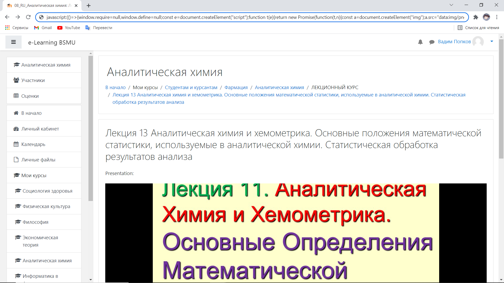

# Moodle presentation download

----------------------------

This repository can help you to turn presentation from Moodle into pdf and download it

## How to use 

1. Open the page with presentation
2. Wait until the loading of page is finished
3. copy this
~~~~
(()=>{window.require=null,window.define=null;const e=document.createElement("script");function t(e){return new Promise(function(t,n){const a=document.createElement("img");a.src="data:img/png;base64,"+e,a.onload=function(){t({w:a.width,h:a.height})}})}e.src="https://cdnjs.cloudflare.com/ajax/libs/jspdf/2.4.0/jspdf.umd.min.js",e.async=!1,document.head.appendChild(e),e.onload=(async()=>{const e=await fetch(window.location.href),n=await e.text(),a=document.createElement("div");a.innerHTML=n;const d=[...a.querySelectorAll("slide")],c=d.map(e=>e.getAttribute("data")),o=new jspdf.jsPDF;o.deletePage(1);const i=await Promise.all(c.map(t));d.map(e=>e.getAttribute("data")).forEach((e,t)=>{const{w:n,h:a}=i[t];return o.addPage([n,a],"l"),o.addImage(e,null,0,0,n,a),o},o),o.save()})})();
~~~~
4. paste it in browser url
5. add javascript: at start to be

6. click enter and wait pdf will be loaded
